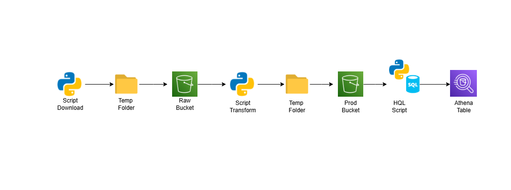

# Projeto ETL Yellow Taxi Data 

Este repositório contém o pipeline de ingestão de dados fornecidos no site de Nova York onde que possui informações sobre os registros de viagens de táxi na cidade.

## Objetivo do Projeto

Criar um pipeline que ingeste as informações de janeiro-maio de 2023 e após isso realizar algumas consultas para responder algumas perguntas em questão.

## Pré-Requisitos

- Python 3.10
- Ambiente virtual
- Bibliotecas (requirements.txt)
- Usuário IAM AWS com acesso ao S3 e Athena

## Estrutura do Projeto

- **conf**: contém o arquivo de configuração do projeto que leva em consideração para a execução
- **notebooks**: os notebooks com as queries de resposta para as perguntas do projeto
- **scripts**: os scripts modularizados separados por funcionalidade.
- **temp**: pasta temporária para armazenamento temporário dos arquivos gerados no pipeline.

## Arquitetura Proposta



## Como executar o projeto localmente

- Crie um ambiente virtual python
- Instale as dependências do projeto
- Crie um arquivo .env dentro da pasta ./scripts com as variáveis de ambiente:   
    ```AWS_ACCESS_KEY_ID={aws_key}```  
    ```AWS_SECRET_ACCESS_KEY={secret_key}```  
    ```AWS_DEFAULT_REGION='us-east-1'```  
- No arquivo connf/conf.yaml, altere as variáveis de bucket e a data de referência que gostaria de fazer o upload
- Execute via linha de comando o arquivo run.py  
```bash #!/bin/bash python3 run.py```   
- Valide a criação da tabela no Athena.

## Features Implementadas

- Download de arquivos por requests
- Upload de arquivos nos buckets S3 padronizado
- Transformação do dado para salvar apenas o que é necessário
- Criação da tabela para consumo no Athena
- Criação da tabela/partição via HQL
- Processo padronizado para download de qualquer data do site.

## Pontos de Melhorias Futuras

- Criação de um pipeline schedulado para execução mensal utilizando orquestradores como Airflow.
- Empacotamento do processo utilizando Docker para garantir portabilidade, reprodutibilidade e facilidade de implantação, isolando todas as dependências em um ambiente padronizado.  
- Adicionar validação de data quality para garantir que os dados estão corretos antes de salva-los e disponibiliza-los na tabela final.
- Criar um processo CI/CD para garantir que todas as etapas de implantação tenham sido executadas e garantindo um pacote mais robusto e validado, adicionando etapas de guardrails e testes unitários.
